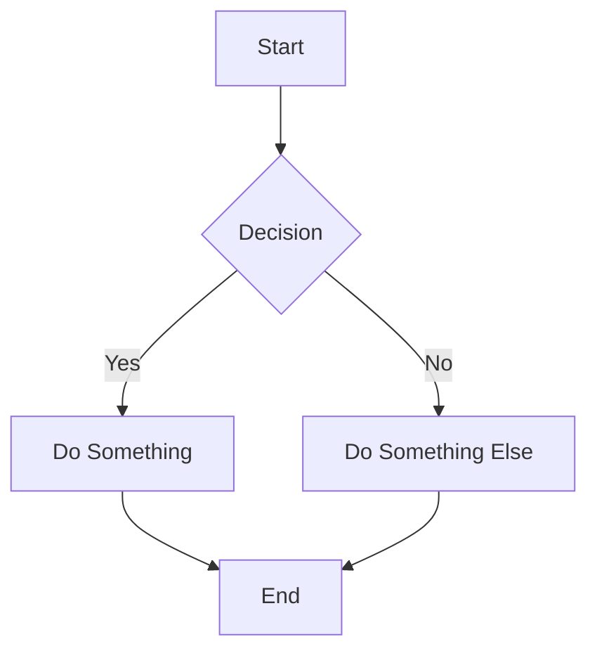
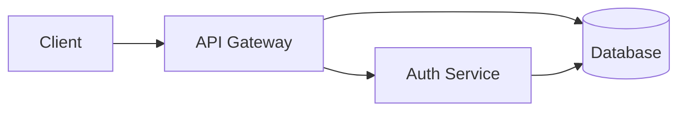

# gobig

[](https://github.com/sroberts/gobig/releases)
[](https://github.com/sroberts/gobig/actions)
[](https://go.dev/)
[](LICENSE)

A command-line tool to generate [big.js](https://github.com/tmcw/big) presentations from Markdown files. Create beautiful, minimal presentations using simple markdown syntax with support for layouts, themes, and speaker notes.

## Features

- 📝 **Simple Markdown**: Write presentations in familiar markdown syntax
- 🎨 **Three Themes**: Dark, light, and white themes included
- 📐 **Grid Layouts**: Flexible CSS Grid-based layouts for complex slides
- 📊 **Mermaid Diagrams**: Create flowcharts, sequence diagrams, and more
- 🗣️ **Speaker Notes**: Hidden notes in HTML comments
- 📦 **Single Binary**: No dependencies, just one executable
- 🔒 **Self-Contained**: Generates single HTML file with embedded assets
- 🖼️ **Image Support**: Auto-converts local images to base64 data URIs

## Installation

### Download Binary (Recommended)

Download the latest release for your platform from the [releases page](https://github.com/sroberts/gobig/releases).

**Available platforms:**
- Linux (amd64, arm64)
- macOS (amd64/Intel, arm64/Apple Silicon)
- Windows (amd64)

Each release includes SHA256 checksums for verification.

### From Source

```bash
git clone https://github.com/sroberts/gobig.git
cd gobig
make install
```

Or build for your platform:

```bash
make build
# Binary will be in bin/gobig
```

### Cross-Compilation

Build for all platforms:

```bash
make build-all
```

This creates binaries for:
- Linux (amd64, arm64)
- macOS (amd64, arm64)
- Windows (amd64)

## Quick Start

1. Create a markdown file (`presentation.md`):

```markdown
# My Presentation

Welcome to my talk!

---

## Agenda

- Topic 1
- Topic 2
- Topic 3

---

## Thank You!
```

2. Generate the presentation:

```bash
gobig -o index.html presentation.md
```

3. Open `index.html` in a browser and present!

## Usage

```bash
gobig [options] <input.md>
```

### Options

| Flag | Description | Default |
|------|-------------|---------|
| `-o <file>` | Output HTML file | stdout |
| `-theme <name>` | Theme: dark, light, or white | dark |
| `-aspect-ratio <ratio>` | Aspect ratio (number or "false") | 1.6 |
| `-title <title>` | Presentation title | From first slide |
| `-version` | Show version information | - |
| `-help` | Show help message | - |

### Examples

```bash
# Output to stdout
gobig presentation.md

# Save to file
gobig -o slides.html presentation.md

# Use light theme
gobig -theme light -o output.html presentation.md

# Custom aspect ratio and title
gobig -aspect-ratio 2 -title "My Amazing Talk" -o slides.html talk.md

# Disable aspect ratio locking
gobig -aspect-ratio false -o output.html slides.md
```

## Markdown Syntax

### Slides

Separate slides with horizontal rules (`---`):

```markdown
# First Slide

Content here

---

# Second Slide

More content

---

# Third Slide
```

### Speaker Notes

Add speaker notes using HTML comments:

```markdown
# My Slide

Visible content

<!--
This is a speaker note.
It will appear in the browser console when presenting.
Multi-line notes are supported!
-->
```

### Slide Metadata

Add metadata to slides using YAML frontmatter in comments:

```markdown
<!-- slide
layout: 50-50
class: custom-class
time-to-next: 10
-->

# Slide with Metadata
```

Available metadata fields:

- `layout`: Grid layout (see Layouts section)
- `class`: Custom CSS class for the slide
- `body-style`: Custom CSS for the body element
- `body-class`: Custom class for the body element
- `time-to-next`: Auto-advance time in seconds (overrides presentation default if set)

### Presentation Metadata

Add presentation-wide metadata at the beginning of your markdown file using YAML frontmatter in comments. This must appear before any slide separators (`---`):

```markdown
<!-- presentation
time-to-next: 5
title: My Presentation
-->

# First Slide

Content starts here...

---

# Second Slide

All slides will auto-advance after 5 seconds
```

Available presentation metadata fields:

- `time-to-next`: Default auto-advance time in seconds for all slides
- `title`: Presentation title (overrides `-title` flag)

**Note:** Per-slide `time-to-next` values override the presentation-level default. This allows you to set a default timing for all slides while customizing individual slides as needed.

#### Auto-Advance Example

Set a default timing for all slides, with specific slides overriding:

```markdown
<!-- presentation
time-to-next: 5
-->

# Slide 1
Advances after 5 seconds (default)

---

# Slide 2
Also advances after 5 seconds (default)

---

<!-- slide
time-to-next: 10
-->

# Slide 3
Overrides default - advances after 10 seconds

---

# Slide 4
No slide-level setting - uses default of 5 seconds
```

This is perfect for **PechaKucha** or **Ignite** style presentations where most slides need consistent timing!

#### Common Timing Patterns

Different presentation formats have standard timing requirements:

**PechaKucha (20x20)**
```markdown
<!-- presentation
time-to-next: 20
-->
```
20 slides, 20 seconds each = 6 minutes 40 seconds total

**Ignite (5x15)**
```markdown
<!-- presentation
time-to-next: 15
-->
```
20 slides, 15 seconds each = 5 minutes total

**Custom Format**
```markdown
<!-- presentation
time-to-next: 30
-->

# Most slides advance after 30 seconds

---

<!-- slide
time-to-next: 60
-->

# Important slide - give audience more time

---

<!-- slide
time-to-next: 5
-->

# Quick transition slide
```

#### Timing Tips and Best Practices

**When to Use Presentation-Level Timing:**
- Consistent pacing across most slides
- Format-specific presentations (PechaKucha, Ignite)
- Training materials with regular intervals
- Demo presentations with synchronized narration

**When to Use Slide-Level Overrides:**
- Title/introduction slides (often longer)
- Complex diagrams that need more viewing time
- Quick transition or section divider slides
- Q&A or discussion slides (can use longer times)

**Manual Control:**
- Navigation keys (arrow keys, page up/down) work even with auto-advance enabled
- Useful for pausing to answer questions during presentation
- Last slide typically won't advance (no next slide to go to)

**Testing Your Timing:**
```bash
# Generate and open your timed presentation
gobig -o timed-presentation.html presentation.md
open timed-presentation.html  # macOS
# or: xdg-open timed-presentation.html  # Linux
# or: start timed-presentation.html     # Windows
```

**Disabling Auto-Advance:**
- Omit `time-to-next` entirely for manual-only navigation
- Use slide-level metadata to disable for specific slides
- Navigate manually during presentation to override timing

### Layouts

Grid-based layouts for complex slides:

#### 50-50 (Two Columns)

```markdown
<!-- slide
layout: 50-50
-->


## Description

Text appears next to the image.
```

#### Other Built-in Layouts

| Layout | Description |
|--------|-------------|
| `50-50` | Two equal columns |
| `75-25` | 75% left, 25% right columns |
| `25-75` | 25% left, 75% right columns |
| `50-50-rows` | Two equal rows |
| `75-25-rows` | 75% top, 25% bottom rows |
| `25-75-rows` | 25% top, 75% bottom rows |
| `grid-3x2` | 3 columns, 2 rows |
| `grid-2x3` | 2 columns, 3 rows |

#### Custom Layouts

Use custom CSS Grid syntax:

```markdown
<!-- slide
layout: grid-template-columns: 1fr 2fr 1fr;
-->

Content split into custom grid
```

### Standard Markdown

All GitHub Flavored Markdown (GFM) is supported:

```markdown
# Headings

## Subheadings

**Bold** and *italic* text

- Bullet lists
- With items

1. Numbered lists
2. Also work

> Blockquotes

`inline code` and

\`\`\`javascript
// Code blocks
function demo() {
  return "with syntax highlighting";
}
\`\`\`

| Tables | Work |
|--------|------|
| Too | ! |

~~Strikethrough~~

[Links](https://example.com)


```

### Mermaid Diagrams

gobig supports [Mermaid.js](https://mermaid.js.org/) diagrams for creating flowcharts, sequence diagrams, class diagrams, and more directly in your markdown.

Simply use a code block with the `mermaid` language tag:

````markdown

````

**Supported diagram types:**
- Flowcharts (`graph`, `flowchart`)
- Sequence diagrams (`sequenceDiagram`)
- Class diagrams (`classDiagram`)
- State diagrams (`stateDiagram`)
- Entity Relationship diagrams (`erDiagram`)
- User Journey diagrams (`journey`)
- Gantt charts (`gantt`)
- Pie charts (`pie`)
- Git graphs (`gitGraph`)

**Theme integration:**
Mermaid diagrams automatically adapt to your presentation theme:
- `dark` theme → Mermaid dark theme
- `light` and `white` themes → Mermaid default theme

**Example slide with diagram:**

````markdown
## System Architecture


````

**Tips:**
- Keep diagrams simple for better readability on slides
- Use consistent styling across diagrams
- Test diagrams render correctly before presenting
- Complex diagrams may need their own slide

For full Mermaid syntax documentation, see [mermaid.js.org](https://mermaid.js.org/).

## Presentation Controls

Once you've generated your HTML presentation, use these controls:

### Navigation

- **Left/Up/PageUp**: Previous slide
- **Right/Down/PageDown**: Next slide
- **Click**: Next slide (unless clicking a link)
- **Swipe**: Navigate on touch devices

### Modes

- **t**: Talk mode (default, single slide)
- **p**: Print mode (2 slides per page with notes)
- **j**: Jump mode (grid overview)

### Direct Navigation

- Navigate to specific slides using hash: `presentation.html#5`
- In jump mode, use arrow keys and Enter

### Speaker Notes

- Open browser developer console (F12 or Cmd+Option+I)
- Notes appear in console for each slide
- Use a second screen to view notes while presenting

## Examples

See the `examples/` directory for sample presentations:

- `basic.md` - Simple presentation demonstrating core features
- `advanced.md` - Advanced features including layouts, notes, and customization

Generate the examples:

```bash
gobig -o basic.html examples/basic.md
gobig -theme light -o advanced.html examples/advanced.md
```

## Project Structure

```
gobig/
├── cmd/gobig/          # CLI application
├── internal/
│   ├── assets/         # Embedded big.js files
│   ├── parser/         # Markdown parsing
│   └── generator/      # HTML generation
├── examples/           # Example presentations
├── Makefile           # Build automation
└── README.md
```

## How It Works

1. **Parse**: Extracts presentation metadata, then splits markdown on `---` into individual slides
2. **Extract**: Pulls out YAML frontmatter and speaker notes from each slide
3. **Convert**: Transforms markdown to HTML using goldmark
4. **Layout**: Applies CSS Grid layouts based on metadata
5. **Embed**: Bundles big.js, big.css, and theme into single HTML
6. **Encode**: Converts local images to base64 data URIs
7. **Generate**: Creates complete, self-contained HTML file with cascaded timing settings

## Credits

- [big.js](https://github.com/tmcw/big) by Tom MacWright - The presentation framework
- [goldmark](https://github.com/yuin/goldmark) - Markdown parsing
- [Mermaid.js](https://mermaid.js.org/) - Diagram and flowchart generation
- Built with Go

## License

MIT License - see LICENSE file for details

## Contributing

Contributions welcome! Please feel free to submit issues and pull requests.

## Roadmap

- [ ] Custom CSS injection
- [ ] Template support
- [ ] Watch mode for live reloading
- [ ] PDF export
- [ ] Syntax highlighting themes
- [ ] Video/audio embedding
