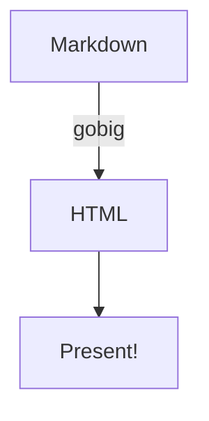

<!-- presentation
time-to-next: 3
-->

# Advanced Features

gobig demonstration with auto-advance

---

## Speaker Notes Example

This slide has detailed speaker notes.

<!--
Speaker notes can be multi-line!

Remember to:
- Explain the context
- Give examples
- Take questions

These notes appear in the browser console when presenting.
-->

---

<!-- slide
layout: 50-50
-->


## Side by Side

Text appears next to the image with a **50-50 layout**.

Perfect for *image + description* slides!

---

<!-- slide
layout: 75-25-rows
-->


Image takes 75% height, text takes 25%

---

<!-- slide
layout: 25-75
-->


## 25-75 Layout

Narrow image on the left, wider text content on the right.

Great for **icons** or **logos** with explanations.

---

## Code Example

```javascript
// big.js automatically sizes text to fit
function demo() {
  console.log("Keep code snippets short!");
  return "8 lines or fewer works best";
}
```

<!-- Remind the audience that code should be minimal and focused -->

---

<!-- slide
layout: grid-3x2
-->

**Feature 1**

Fast

**Feature 2**

Simple

**Feature 3**

Powerful

**Feature 4**

Flexible

**Feature 5**

Modern

**Feature 6**

Open Source

---

## Tables

| Feature | Status | Notes |
|---------|--------|-------|
| Markdown | ✅ | Full GFM support |
| Layouts | ✅ | Grid-based |
| Themes | ✅ | 3 built-in |
| Images | ✅ | Auto base64 |

---

## Emphasis

You can use **bold**, *italic*, and ~~strikethrough~~.

> Blockquotes work too!

- Bullet lists
- Also supported
- With proper formatting

---

<!-- slide
time-to-next: 5
-->

## Override Auto-Advance

This slide overrides the presentation default and advances after 5 seconds instead of 3.

Perfect for **PechaKucha** or **Ignite** style presentations!

<!-- This demonstrates how per-slide time-to-next overrides the presentation default -->

---



<!-- Mermaid diagrams are rendered to SVG at build time -->

---

# Thank You!

**gobig** - Markdown to big.js presentations

Built with ❤️ using Go
