# Mermaid Diagram Test Suite

Testing various Mermaid diagram types in gobig

---

## Flowchart

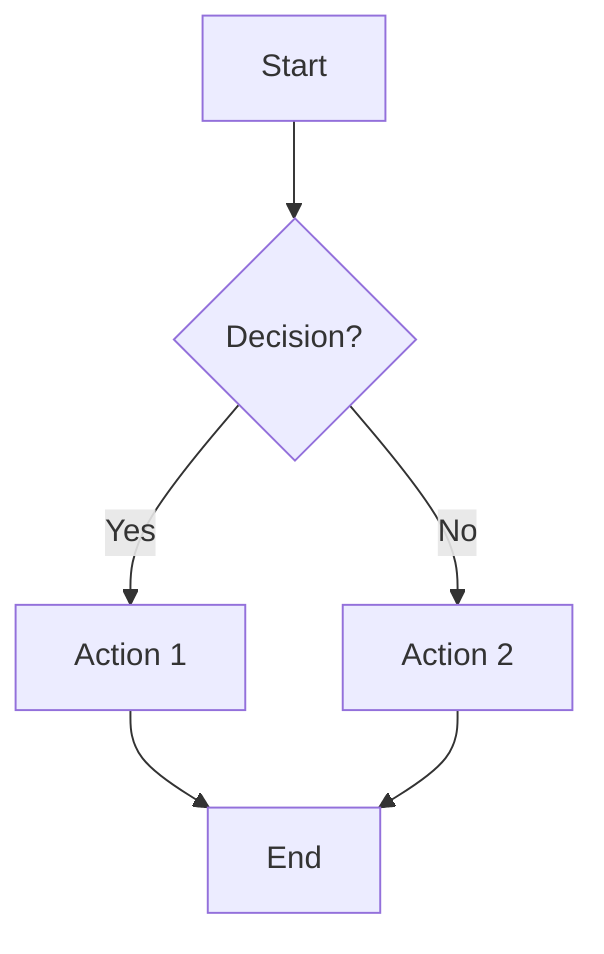

---

## Sequence Diagram

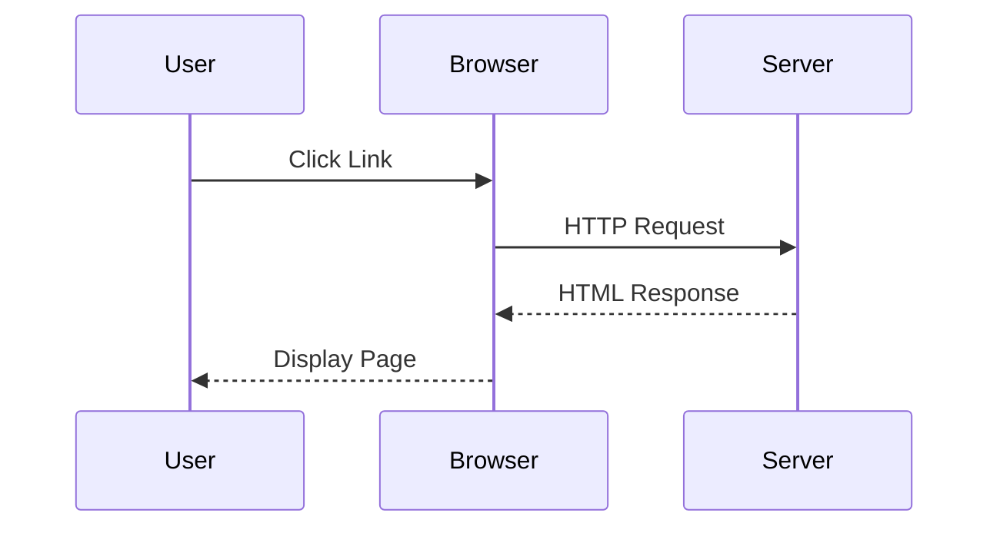

---

## Class Diagram

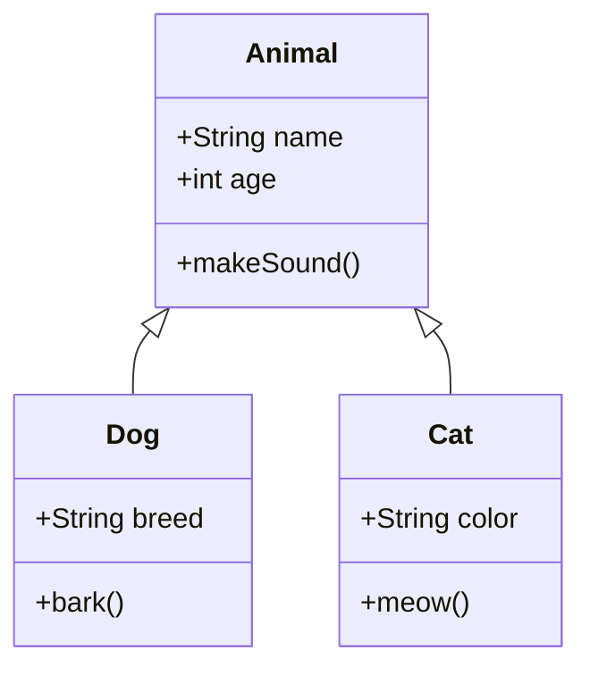

---

## State Diagram

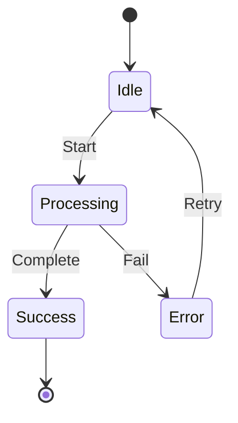

---

## Entity Relationship Diagram

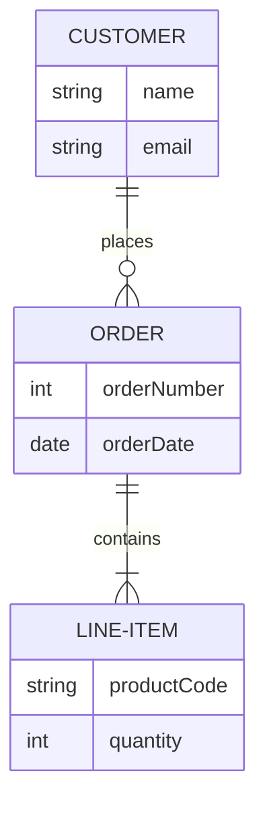

---

## Gantt Chart

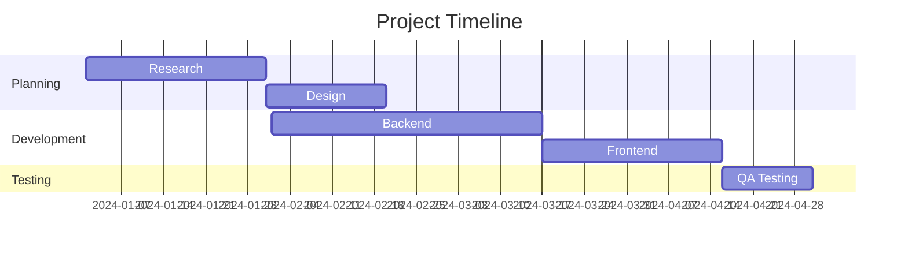

---

## Pie Chart

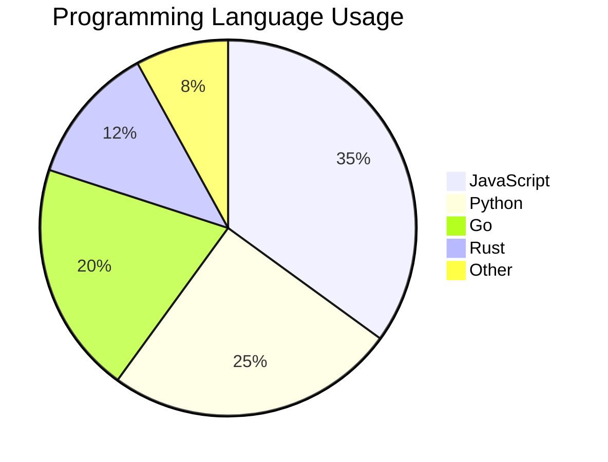

---

## Git Graph

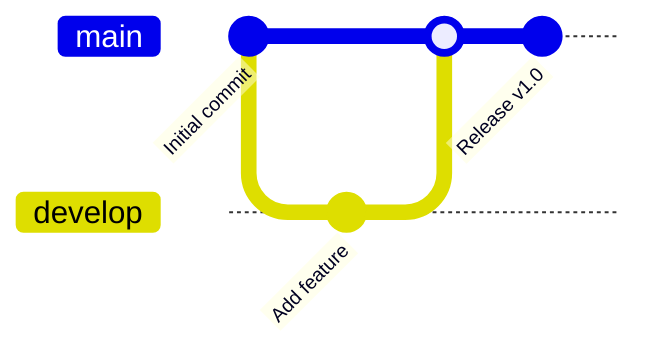

---

## Journey Diagram

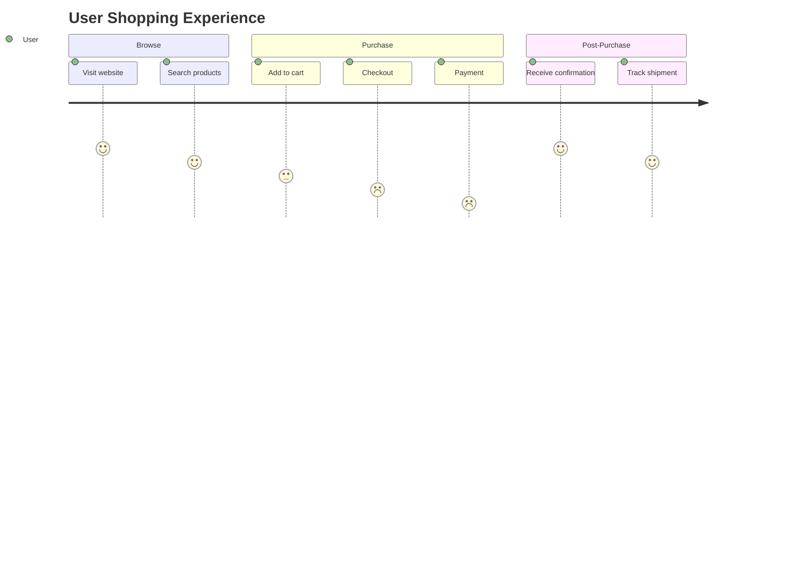

---

## Mindmap

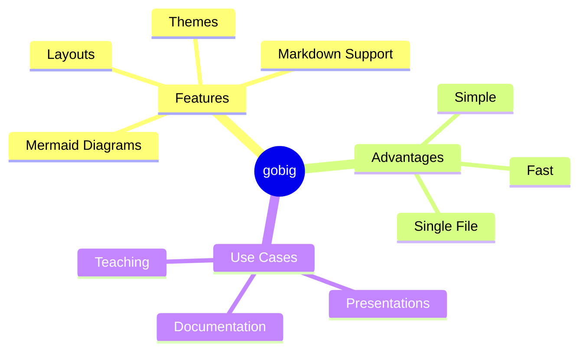

---

## Timeline

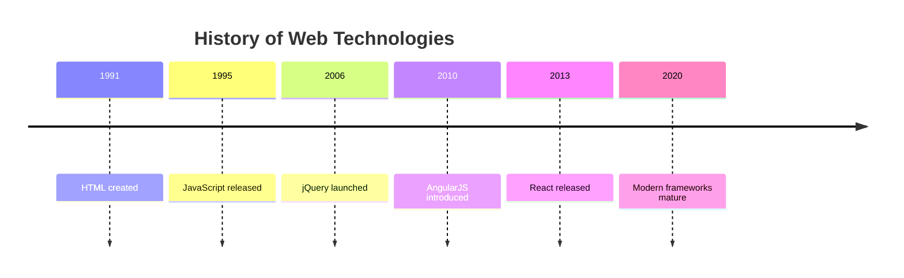

---

## Requirement Diagram

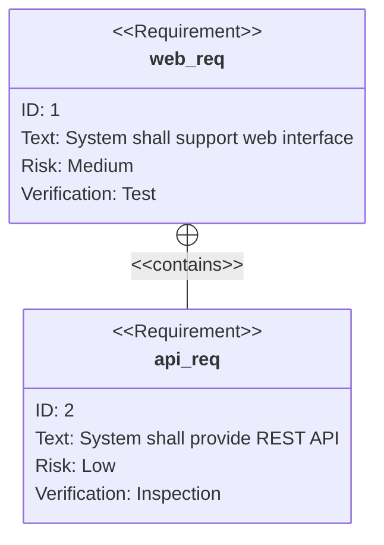

---

# Summary

All Mermaid diagram types tested with **dark theme**

Each diagram should display with:
- **Light text** on dark backgrounds
- **Visible borders** and arrows
- **Proper contrast** for readability
